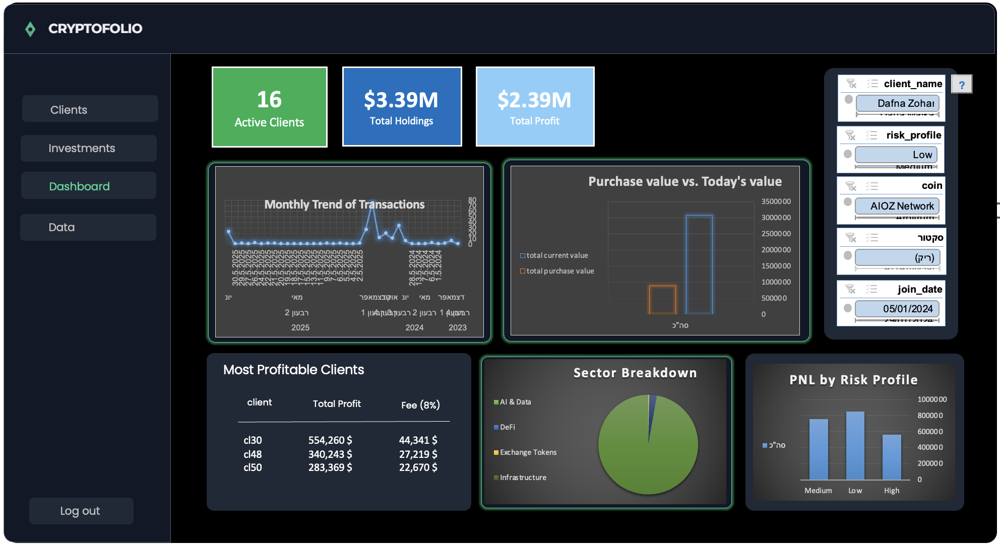

# CryptoFolio – Excel + VBA Project

מערכת לניהול תיקי השקעות ללקוחות: ניתוח נתונים, מעקב ביצועים ודוחות.

## הורדה
[Download Excel file (.xlsm)](https://github.com/estipla05/CryptoFolio---Excel-VBA-project/raw/main/214736456-%D7%A4%D7%A8%D7%95%D7%99%D7%A7%D7%98%20%D7%92%D7%9E%D7%A8%20%D7%90%D7%A1%D7%AA%D7%99%20%D7%A4%D7%9C%D7%98%D7%A0%D7%A8.xlsm)

## שימוש
1. הורידו את הקובץ ופתחו אותו ב-Excel.
2. אפשרו מאקרו (VBA) כאשר תתבקשו.
3. הזינו נתוני דמו או טעינת נתוני תיק לקוח.

## פיצ'רים
- ניהול פורטפוליו ללקוחות
- ניתוח נתונים ו-KPIs
- דוחות וגרפים
- אפשרות הרחבה לנתוני קריפטו

## צילום מסך

## הערות
- אין להעלות נתוני לקוחות אמיתיים לרפו ציבורי.
- מומלץ להשתמש בנתוני דמו בלבד.
